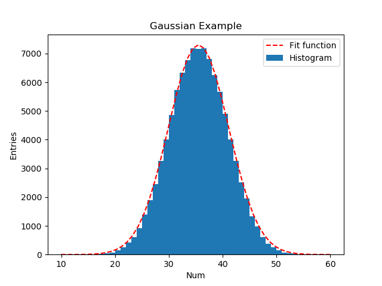

# matplotlib简易教程

:fire:忽必烈李@bilibili:fire:

[toc]


## Graph

```python
import matplotlib.pyplot as plt

x=[1,2,3,4,5]
y=[1,4,9,16,25]

fig =plt.figure(figsize=(8,6))
plt.plot(x,y)
plt.xlabel('X')
plt.ylabel('y')
plt.title("First Graph")
plt.savefig('graph.png')
#plt.show
```


## Function

```python
import matplotlib.pyplot as plt
import numpy as np

def f(x):
    return np.sqrt(x)

def g(x):
    return np.sin(x)

x=np.linspace(0,5)
y=f(x)
y2=g(x)

fig =plt.figure(figsize=(8,6))
plt.plot(x,y,color='r',linestyle='dashed',label='plot 1')
plt.plot(x,y2,color='b',linestyle='dashed',label='plot 2')
plt.xlabel('X')
plt.ylabel('y')
ax=plt.gca()  #get currunt axis
ax.set_xlim(1,4)  #设置X轴范围
ax.set_ylim(0,2)  #设置y轴范围
plt.title("First function")
plt.legend(loc="best") #best lower left upper right
plt.tight_layout()  #固定画板内容
plt.show()
# plt.savefig('tut.pdf')
```


## 数据分析与可视化

```python
import matplotlib.pyplot as plt
import numpy as np

x,y,xerr,yerr = np.loadtxt("data.txt",unpack=True) #unpack 自动分割数据列
print(x,y,xerr,yerr)

p,V = np.polyfit(x,y,1,w=yerr,cov=True) #拟合函数 1为维数, cov协方差矩阵
m=p[0]
b=p[1]
merr=V[0][0]
berr=V[1][1]
print(m,b,merr,berr) #m为斜率，b为截距

xx = np.linspace(1,10)
yy = m*xx+b

fig =plt.figure(figsize=(8,6))
plt.errorbar(x,y,xerr,yerr,linestyle="none",marker='o',markersize=3,capsize=3,color="k",label="Data points")
plt.plot(xx,yy,color="r",linestyle='dashed',label="Fit function")
plt.xlabel('t[s]')
plt.ylabel('s[m]')
ax=plt.gca()  #get currunt axis
ax.margins(x=0,y=0)
plt.title("Data Analysis")
plt.legend(loc="best") #best lower left upper right
plt.grid()
plt.tight_layout()  #固定画板内容
# plt.show()
plt.savefig('dataanalyse.png')
```


## Histogram & Random 

```python
import matplotlib.pyplot as plt
import numpy as np

x = np.random.randint(1,7,1000)

mean = format(x.mean(),'.2f')
std = format(x.std(),'.2f')

plt.hist(x,bins=6,facecolor='r',alpha=0.5,density=1)  # density 表示是归一化参数，或者概率密度
plt.text(4,0.15,'Entries: '+str(len(x))+'\n'+"Mean: "+str(mean)+"\n"+"Std: "+str(std)+'\n')
plt.xlabel('Num')
plt.ylabel('Entries')
plt.title("Histogram")
plt.savefig('hist_rand.png')
# plt.show
```


## Gaussian & Fitting

```python
import matplotlib.pyplot as plt
import numpy as np
from scipy.optimize import curve_fit

def gauss(x,amp,mu,sigma):
    return amp*np.exp(-(x-mu)**2/(2*sigma**2))

N=100000
r= np.empty(N)
for i in range(10):
    r+= np.random.randint(1,7,N)

n,bins,patches = plt.hist(r,bins=50,range=(10,60),label='Histogram')
print(n,bins,patches)

x = np.linspace(10,60,50)
y=n
popt,pcov = curve_fit(gauss,x,y,p0=(7000,35,5)) #p0 为初始化值
print(popt)
y=gauss(x,popt[0],popt[1],popt[2])

plt.plot(x,y,color='r',linestyle='dashed',label='Fit function')

plt.xlabel('Num')
plt.ylabel('Entries')
plt.title("Gaussian Example")

plt.legend()
plt.savefig('hist_fit.png')
# plt.show()
```



## 2D Histogram图形绘制

```python
import matplotlib.pyplot as plt
import numpy as np
from matplotlib import cm,colors

x = np.random.normal(0,1,1000000)
y = np.random.normal(0,1,1000000)

plt.hist2d(x,y,bins=(100,100),cmap=cm.gist_rainbow,range=[(-2,2),(-2,2)],norm=colors.LogNorm())

plt.xlabel('x')
plt.ylabel('y')
plt.title("Example 2D Histogram")
plt.colorbar(label='Entries')
plt.savefig('2D_hist.png')
# plt.show()
```


## 3D Surface plot

```python
from mpl_toolkits.mplot3d import Axes3D
import matplotlib.pyplot as plt
import numpy as np
from matplotlib import cm  
# colormap 


def f(x,y):
    return x**2+y**2

x = np.arange(-5,5,0.1)
y = np.arange(-5,5,0.1)

X,Y =np.meshgrid(x,y)

Z = f(X,Y)

fig = plt.figure(figsize=(5,4))
ax = plt.gca(projection="3d")
surf = ax.plot_surface(X,Y,Z,cmap=cm.gist_rainbow)
ax.set_xlabel('x values')
ax.set_ylabel('y values')
ax.set_zlabel('z values')
ax.set_zlim(0,100)
ax.view_init(elev=20,azim=45.) #polar angle 20,azumith angle 45
plt.colorbar(surf) 
plt.savefig('3d.png')
# plt.show()
```


## 梯度图Contour Plots

描述两同种电荷和异种电荷形成的电场

```python
'''
绘制两个电荷形成的电场
1)异种电荷
2)同种电荷
'''
from mpl_toolkits.mplot3d import Axes3D
import matplotlib.pyplot as plt
import numpy as np
from matplotlib import cm  
# colormap 


def f(x,y):
    return x**2+y**2

x = np.linspace(-5,5,200)
y = np.linspace(-5,5,200)

X,Y =np.meshgrid(x,y)

X0 = -2
X1 = +2
for i in range(2):   # 0: 异种电荷，1：同种电荷
    F = abs((X-X0)/np.sqrt((X-X0)**2+Y**2)+(-1)**i*(X-X1)/np.sqrt((X-X1)**2+Y**2))
    E = -abs(1/np.sqrt((X-X0)**2+Y**2)+(-1)**i*1/np.sqrt((X-X1)**2+Y**2))

    plt.contourf(X, Y, F, 100, cmap='rainbow')  # surf  100 等高线层数
    plt.colorbar()
    plt.contour(X, Y, F, 10, colors='black')  # 10 等高线条数
    plt.contour(X, Y, E, levels=[-0.5, -0.4, -0.3, -0.2, -0.1, -0.05], colors='black')  # 10 等高线条数
    plt.savefig("electron_"+str(i)+'.png')
    plt.close()
```


## 制作动画

 ```python
 
 import matplotlib.pyplot as plt
 import numpy as np
 import math
 # colormap 
 
 def f1(x,i):
     return np.sin(x+i/16)
 
 def f2(x,i):
     return np.sin(-x+i/16)
 
 for i in range(100):
     x = np.linspace(0,2*math.pi,100)
     y1= f1(x,i)
     y2= f2(x,i)
     
     plt.plot(x,y1,color='k')
     plt.plot(x,y2,color='k')
     plt.plot(x,y1+y2,color='r')
     plt.ylim(-2,2)
     plt.savefig('anim'+str(i).zfill(3)+'.png') # zfill(3), 表示输出3位数
     plt.close()
 ```

下载`imagemagick`，在`png`文件所在目录下，运行如下命令，制作`anim.gif`动画

```sh
magick.exe convert -delay 1 ./anim*png ./anim.gif
```


## 解析数据与绘图

在linux下采用如下命令生成待处理数据

```sh
while true; do date >>temperature.txt; sensors>>termperature.txt; sleep 5; done
```

 采用python解析数据并进行绘图

```python
import matplotlib.pyplot as plt
from  collections import OrderedDict  
import numpy as np

data = OrderedDict()

f = open('temperature.txt',encoding='UTF8')
flag =True
for line in f:
    if '2022年' in line:
        time = line.split(' ')[4].strip()
        # print(time)
        data[time]=[]
    
    if 'coretemp-isa-0001' in line:
        flag = True

    if 'coretemp-isa-0000' in line:
        flag = False
             
    if flag==True and 'Core 0:' in line:
        core0 = line.split(' ')[9].strip().replace('+','').replace('°C','')  #strip()丢弃空行等
        # print(core0)
        data[time].append(core0)
    
    if flag==True and 'Core 1:' in line:
        core1 = line.split(' ')[9].strip().replace('+','').replace('°C','')  #strip()丢弃空行等
        # print(core0)
        data[time].append(core1)
        
print(data)

x = []
y = []

for time in data:
    x.append(time)
    y.append(data[time][0])

print(x)
print(y)

figure = plt.figure(figsize=(10,5))
plt.plot(x,y)
plt.xlabel('time')
plt.ylabel('temperature')
plt.savefig('temperature.png')
# plt.show()
```


## 参考资料：

[1] https://www.youtube.com/playlist?list=PLLybgCU6QCGVFipsHDlBANIaM4WJ1U0oe

[2]官方资料 https://matplotlib.org/

[3] https://matplotlib.org/stable/users/index.html

[4] https://e2eml.school/blog.html#131
